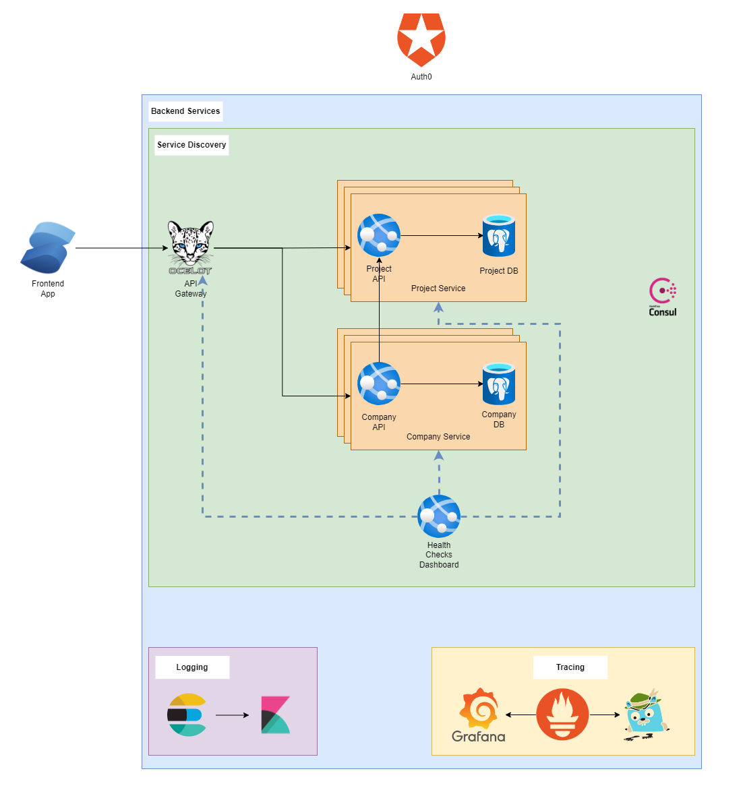

# Health Checks
Health checks are a mechanism used to monitor the health and availability of components within a system, such as microservices or databases. They are essential for ensuring that all components are functioning correctly and can be used to detect and respond to any issues or failures.

Health checks typically involve periodically sending requests to the component being monitored and evaluating the response. Based on the response, the health check can determine whether the component is healthy or experiencing any problems. This information is crucial for system administrators, developers, and operators to understand the overall health of the system and take appropriate actions if necessary.

# Steeltoe Health Checks
Steeltoe is a set of open-source libraries for .NET that provides various capabilities for building cloud-native applications. One of the features offered by Steeltoe is health checks, which enables you to implement and expose health check endpoints in your .NET applications.
By leveraging Steeltoe's health checks, you can easily add monitoring capabilities to your microservices and gather insights into their health and availability.
Steeltoe provides a comprehensive set of health checks that you can leverage to monitor different aspects of your .NET applications. Here are some of the key health checks offered by Steeltoe:

* **Liveness Health Check**: This health check indicates whether the application is alive or not. It is primarily used to determine if the application is running and responsive. It can be used by orchestrators or load balancers to decide whether to route traffic to the application or consider it as unhealthy.
* **Readiness Health Check**: The readiness health check indicates whether the application is ready to handle requests. It is used to signal that the application has completed initialization and is in a state to handle traffic. This health check is beneficial during deployment scenarios, allowing orchestration platforms to wait until the application is ready before routing requests to it.
* **Database Health Check**: Steeltoe provides health checks for database connectivity, allowing you to monitor the availability and connectivity of your databases. These health checks can verify the connection to the database server, execute test queries, and ensure that the database is functioning correctly.
* **Messaging Health Check**: If your application relies on messaging queues or brokers, Steeltoe offers health checks to monitor the connectivity and availability of messaging systems such as RabbitMQ or Apache Kafka. These health checks can verify the connection to the messaging system and ensure that it is ready to handle messages.
* **External Dependency Health Checks**: Steeltoe enables you to define health checks for external dependencies that your application relies on, such as RESTful APIs, SOAP services, or other microservices. These health checks can verify the availability and responsiveness of these dependencies, ensuring that your application can properly communicate with them.
* **Custom Health Checks**: In addition to the built-in health checks, Steeltoe allows you to create custom health checks tailored to your specific application requirements. You can implement custom health checks to monitor any custom components or subsystems within your application.

# Health Checks Dashboard
In the Blazor application, we have implemented a configurable mechanism that allows you to specify the Actuator/Health URL for each service. This approach enables you to retrieve health information about the services and display it in your application's dashboard.

The Actuator is a feature originally provided by Spring Boot and brought over to the .NET side via Steeltoe, which exposes various operational endpoints for monitoring and managing your application. The /health endpoint, in particular, provides health information about the application, including its dependencies.

By configuring the Actuator/Health URL for each service in the dashboard, you can programmatically send requests to those endpoints and retrieve the health status of the corresponding services. This information can then be displayed in your application's dashboard, giving you visibility into the health of your services and allowing you to take appropriate actions based on their status.

With this setup, you have a flexible and configurable way to monitor the health of your services and provide valuable insights to your application users or administrators.

